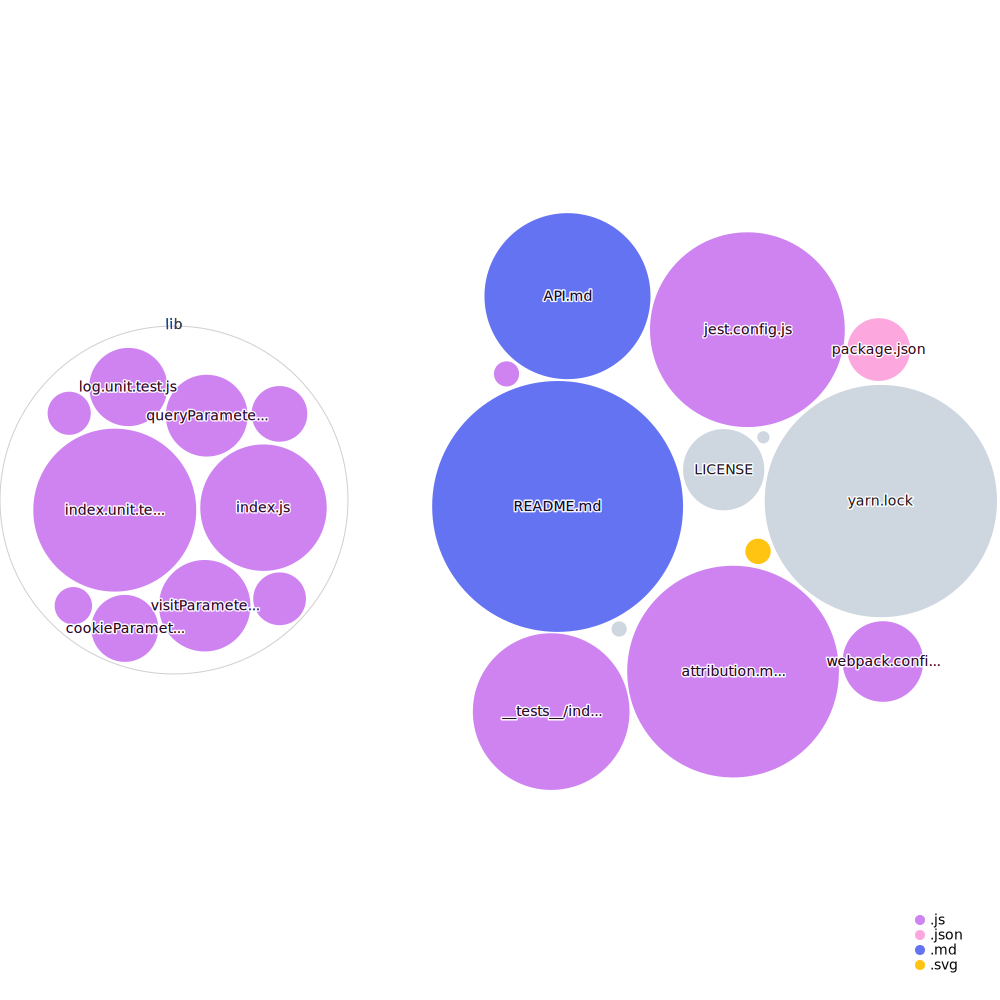

# Attribution.js

Attribution.js automatically collects and stores marketing channel data into localStorage, and makes it available via a simple to use API to be used in internal and external analytics tools.

Attribution.js is open source and powers our attribution and lead scoring tools at [Pearmill](https://pearmill.com?utm_campaign=attribution-js&utm_source=open-source&utm_medium=github), a software-powered advertising growth studio.

You can read [this short background story](https://github.com/pearmill/attribution.js/#background) about why we've developed this and what problem it solves.

Specifically, this library, tracks all UTM parameters (`utm_campaign`, `utm_source`, etc.) as well as a few key cookies (`_fbp`, `_fbc` from Facebook, `_ga` from GA, etc.) and saves them to localStorage. You can then retrieve them and pass them along as part of user actions to your internal or external analytics tools.

## Getting started

The easiest way to get started is to embed the script onto every page of your website, and retrieve the data when the user is making an action to retrieve the latest attribution data.

### Install

If you have a single-page web-app, you can use the package:

```bash
npm install @pearmill/attribution.js

# Or if you're using Yarn
yarn add @pearmill/attribution.js
```

## Embed

Alternatively, you can embed the script by copy pasting the code below:

```javascript
!function(t){var e={};function r(n){if(e[n])return e[n].exports;var o=e[n]={i:n,l:!1,exports:{}};return t[n].call(o.exports,o,o.exports,r),o.l=!0,o.exports}r.m=t,r.c=e,r.d=function(t,e,n){r.o(t,e)||Object.defineProperty(t,e,{enumerable:!0,get:n})},r.r=function(t){"undefined"!=typeof Symbol&&Symbol.toStringTag&&Object.defineProperty(t,Symbol.toStringTag,{value:"Module"}),Object.defineProperty(t,"__esModule",{value:!0})},r.t=function(t,e){if(1&e&&(t=r(t)),8&e)return t;if(4&e&&"object"==typeof t&&t&&t.__esModule)return t;var n=Object.create(null);if(r.r(n),Object.defineProperty(n,"default",{enumerable:!0,value:t}),2&e&&"string"!=typeof t)for(var o in t)r.d(n,o,function(e){return t[e]}.bind(null,o));return n},r.n=function(t){var e=t&&t.__esModule?function(){return t.default}:function(){return t};return r.d(e,"a",e),e},r.o=function(t,e){return Object.prototype.hasOwnProperty.call(t,e)},r.p="",r(r.s=1)}([function(t,e,r){var n,o;!function(i){if(void 0===(o="function"==typeof(n=i)?n.call(e,r,e,t):n)||(t.exports=o),!0,t.exports=i(),!!0){var c=window.Cookies,u=window.Cookies=i();u.noConflict=function(){return window.Cookies=c,u}}}((function(){function t(){for(var t=0,e={};t<arguments.length;t++){var r=arguments[t];for(var n in r)e[n]=r[n]}return e}function e(t){return t.replace(/(%[0-9A-Z]{2})+/g,decodeURIComponent)}return function r(n){function o(){}function i(e,r,i){if("undefined"!=typeof document){"number"==typeof(i=t({path:"/"},o.defaults,i)).expires&&(i.expires=new Date(1*new Date+864e5*i.expires)),i.expires=i.expires?i.expires.toUTCString():"";try{var c=JSON.stringify(r);/^[\{\[]/.test(c)&&(r=c)}catch(t){}r=n.write?n.write(r,e):encodeURIComponent(String(r)).replace(/%(23|24|26|2B|3A|3C|3E|3D|2F|3F|40|5B|5D|5E|60|7B|7D|7C)/g,decodeURIComponent),e=encodeURIComponent(String(e)).replace(/%(23|24|26|2B|5E|60|7C)/g,decodeURIComponent).replace(/[\(\)]/g,escape);var u="";for(var a in i)i[a]&&(u+="; "+a,!0!==i[a]&&(u+="="+i[a].split(";")[0]));return document.cookie=e+"="+r+u}}function c(t,r){if("undefined"!=typeof document){for(var o={},i=document.cookie?document.cookie.split("; "):[],c=0;c<i.length;c++){var u=i[c].split("="),a=u.slice(1).join("=");r||'"'!==a.charAt(0)||(a=a.slice(1,-1));try{var f=e(u[0]);if(a=(n.read||n)(a,f)||e(a),r)try{a=JSON.parse(a)}catch(t){}if(o[f]=a,t===f)break}catch(t){}}return t?o[t]:o}}return o.set=i,o.get=function(t){return c(t,!1)},o.getJSON=function(t){return c(t,!0)},o.remove=function(e,r){i(e,"",t(r,{expires:-1}))},o.defaults={},o.withConverter=r,o}((function(){}))}))},function(t,e,r){t.exports=r(2)},function(t,e,r){"use strict";r.r(e);var n={};function o(t,e){return function(t){if(Array.isArray(t))return t}(t)||function(t,e){if(!(Symbol.iterator in Object(t)||"[object Arguments]"===Object.prototype.toString.call(t)))return;var r=[],n=!0,o=!1,i=void 0;try{for(var c,u=t[Symbol.iterator]();!(n=(c=u.next()).done)&&(r.push(c.value),!e||r.length!==e);n=!0);}catch(t){o=!0,i=t}finally{try{n||null==u.return||u.return()}finally{if(o)throw i}}return r}(t,e)||function(){throw new TypeError("Invalid attempt to destructure non-iterable instance")}()}r.r(n),r.d(n,"save",(function(){return y})),r.d(n,"settings",(function(){return b})),r.d(n,"params",(function(){return v})),r.d(n,"firstClickParams",(function(){return w})),r.d(n,"historicalParams",(function(){return _}));var i=r(0),c=r.n(i),u=function(t){var e={};return t.trackCookies.map((function(t){var r=c.a.get(t);r&&(e[t]=r)})),e},a=function(){if(window.attribution&&window.attribution.settings&&window.attribution.settings().debug){for(var t=arguments.length,e=new Array(t),r=0;r<t;r++)e[r]=arguments[r];console.log.apply(console.log,["[Attribution.js]"].concat(e))}},f=function(){for(var t=arguments.length,e=new Array(t),r=0;r<t;r++)e[r]=arguments[r];console.error.apply(console.error,["[Attribution.js]"].concat(e))},l=function(t){try{var e=localStorage.getItem(t.localStorageName);return JSON.parse(e)||[]}catch(t){return f("[localStorage.getItem + parse failed]",t),[]}};function s(t,e){var r=Object.keys(t);if(Object.getOwnPropertySymbols){var n=Object.getOwnPropertySymbols(t);e&&(n=n.filter((function(e){return Object.getOwnPropertyDescriptor(t,e).enumerable}))),r.push.apply(r,n)}return r}function p(t,e,r){return e in t?Object.defineProperty(t,e,{value:r,enumerable:!0,configurable:!0,writable:!0}):t[e]=r,t}function d(t){return function(t){if(Array.isArray(t)){for(var e=0,r=new Array(t.length);e<t.length;e++)r[e]=t[e];return r}}(t)||function(t){if(Symbol.iterator in Object(t)||"[object Arguments]"===Object.prototype.toString.call(t))return Array.from(t)}(t)||function(){throw new TypeError("Invalid attempt to spread non-iterable instance")}()}var m={localStorageName:"_attrbjs",limitVisits:5,trackQueryParameters:["utm_campaign","utm_medium","utm_source","utm_content","utm_term","fbclid"],trackCookies:["_fbc","_fbp","_ga","_gid","__utma","__utmb","__utmc","__utmz","__utmv","__utmx","__utmxx","_gaexp","_opt_awcid","_opt_awmid","_opt_awgid","_opt_awkid","_opt_utmc"],trackReferrer:!0,ignoreVisitsWithoutUTMParameters:!0,visitFilterFunction:null,debug:!1},g=null,y=function(){var t,e,r,n=l(m);if(g={time:(new Date).toUTCString(),query:(t=m,e={},r={},window.location.search.substring(1).split("&").map((function(n){var i=o(n.split("="),2),c=i[0],u=i[1],a=decodeURIComponent(c),f=decodeURIComponent(u);e[a]=f,t.trackQueryParameters.indexOf(a)>=0&&(r[a]=f)})),r),cookies:u(m),page:window.location.href},m.trackReferrer&&(g.referrer=document.referrer),m.ignoreVisitsWithoutUTMParameters){var i=!0;if(Object.keys(g.query||{}).forEach((function(t){/utm/i.test(t)&&(i=!1)})),i)return void a("Ignoring visit, no UTM parameters found.")}if(!m.visitFilterFunction||m.visitFilterFunction(g)){var c=[].concat(d(n),[g]).filter((function(t){return!!t}));return c.length>m.limitVisits&&(c=[c[0]].concat(d(c.splice(2,c.length)))),function(t,e){try{var r=JSON.stringify(e);localStorage.setItem(t.localStorageName,r)}catch(t){f("[localStorage.setItem + parse failed]",t)}}(m,c),g}a("Ignoring visit, visitFilterFunction returned falsey.")},b=function(t){return t&&(m=function(t){for(var e=1;e<arguments.length;e++){var r=null!=arguments[e]?arguments[e]:{};e%2?s(Object(r),!0).forEach((function(e){p(t,e,r[e])})):Object.getOwnPropertyDescriptors?Object.defineProperties(t,Object.getOwnPropertyDescriptors(r)):s(Object(r)).forEach((function(e){Object.defineProperty(t,e,Object.getOwnPropertyDescriptor(r,e))}))}return t}({},m,{},t)),m},v=function(){return g||y(),g},w=function(){return l(m)[0]},_=function(){return l(m)};window.attribution=n;e.default=n}]);

attribution.save();
```

This automatically calls the [attribution.save()](https://github.com/pearmill/attribution.js/blob/master/API.md#save) function (in the last line). If you're modifying the settings, call the [attribution.settings()](https://github.com/pearmill/attribution.js/blob/master/API.md#settings) function before the [attribution.save()](https://github.com/pearmill/attribution.js/blob/master/API.md#save) call.

## Usage

In order to actually track a visit, you are to call [attribution.save()](https://github.com/pearmill/attribution.js/blob/master/API.md#save) function.

You can control the parameters the module saves, and how it tracks visits using the [attribution.settings()](https://github.com/pearmill/attribution.js/blob/master/API.md#settings) function.

### Example

Here's an example usage alongside Segment:

```javascript
const params = attribution.save();

Segment.track('Sign Up', {
  ...params.query
});

```

* * *

# Background

If you've ever been part of a sophisticated performance marketing team, you'll know that they are focused on understanding which channels and campaigns are performing better than the others in order to focus their time and attention in optimizing them. This is called marketing channel attribution.

Plenty of analytics tools like Google Analytics, Mixpanel, and Amplitude have done a decent job at simplifying common attribution problems. However, this has lead to it being impossible to match data across multiple analytics tools to first-party channel data or internal data. They're either using black-box fingerprinting, or their attribution-models aren't able to be modified to the use-case of the team.

At [Pearmill](https://pearmill.com?utm_campaign=attribution-js&utm_source=open-source&utm_medium=github) – we help companies grow through paid digital advertising (like Facebook, Google, etc.), and we'd like to be sure that the budget we're spending on each campaign, ad set, or singular ad has a positive return on investment.

In order to completely trust that we're doing a good job, we've written our own tools to ensure our ad-spend is efficient. As we grow, we've realized that we can't help every company with our services – so we've decided to open source some of our internal tooling in order to help teams become as sophisticated with their work as we are.

Attribution.js is the foundation of our attribution tools. We hope you find it useful.

# License
MIT


# Codebase Visualization

